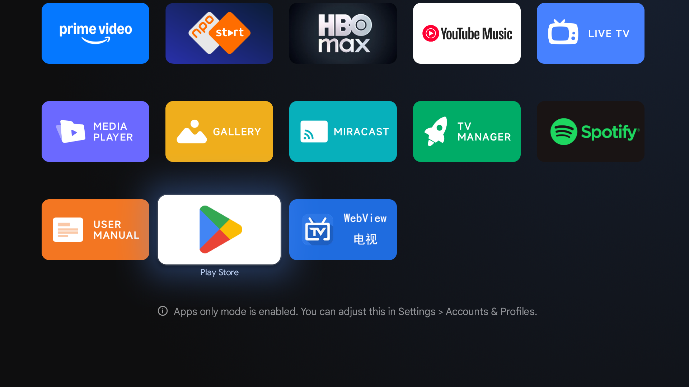

# Google Play Launcher (Android TV)


A minimal Android TV launcher app that opens Google Play Store on Google TV devices.

## Features
- TV launcher entry point (Leanback + standard launcher)
- Tries Play Store app first, falls back gracefully if not available

## Requirements
- Android Studio (or Gradle CLI)
- Android 10+ (minSdk 29)

## Build
Debug APK:
```bash
./gradlew :app:assembleDebug
```

Release APK:
```bash
./gradlew :app:assembleRelease
```
